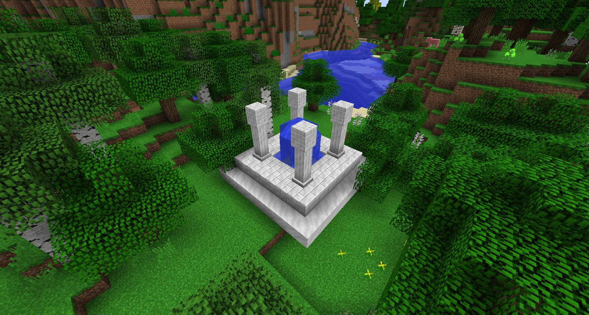
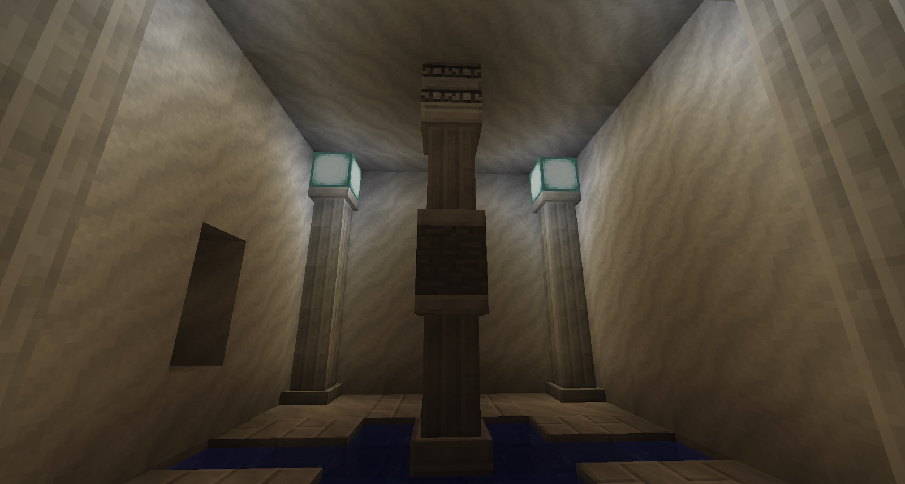
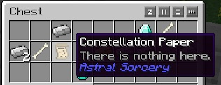

**Astral Tome** - When you startup your world with Astral Sorcery installed you will spawn with a Tome on your hotbar, this little book is used throughout the mod and will act as a little guide and a sort of encyclopedia of the mod. When you open your Tome you will have one tab on the top right “ **_Knowledge_** ”. As you progress through the mod other tabs will open up (more on these later).     

If you hover over the picture of the galaxy while the journal is open and double click (or scroll) “Discovery” you will find a tree of research. In the beginning stages you will have 7 boxes, all with more details about each box. As you progress through the mod, more boxes will appear. The boxes are connected by white lines. These strands have a small animation showing you the progression of items (e.g. normal Marble leads to sooty Marble).

If you do not spawn with one or you die and lose it, you can always craft a new one. When browsing through this book, right-click will help you go back a page and simply double clicking the tab on the right will take you to that page.

If you sneak + right-click while holding the Astral Tome, you will open a small storage space for Constellation papers you have found.

**Rock Crystal Ore** - Rock Crystal ore can be found deep underground at level 4 (give or take a few levels up or down) and below by using a Resonating Wand. It requires a diamond pickaxe (this could be different depending on other mods installed; needs to be able to mine obsidian) to harvest. A warning: Rock Crystal Ore can only be mined by a player standing within 10 blocks of it, anything else (like a quarry) and the ore will drop nothing.

**Rock Crystals** - these drop from Rock Crystal ore (between 1 and 3, more with Fortune enchantment), these Rock Crystals do NOT stack in your inventory. Each Rock Crystal has unique attributes, you will not know what these attributes are if you have just started the mod. More on this later.

**Aquamarine Shale** - Aquamarine Shale can be found by riverbeds and beaches as they generate in sand. They can be mined with a shovel and drop Aquamarine. The drops are affected by Fortune.

**Aquamarine**- These can be found in shrines that are scattered around the world and these can also be mined from Aquamarine Shale. These are used for crafting various items and tools in the mod.

**Faint Amaranth** - This flower spawns through your world and gives off a faint glow, breaking it will give you Glowstone. You can also harvest it with a pair of shears should you want to replant it.

**Shrines** - There are 4 different sizes of shrines and these are large (and sometimes small) structures made of Marble and Marble Pillars. Small shrines will have a chest with resources under one of the pillars, these are the most common shrines you will come across. Bigger shrines will have more chests but will also have a Collector Crystal in it. Other shrines can be found in Deserts and underground.

Treasure Shrines will have a stone block that, if mined, will keep spawning a variety of ore and stone blocks in its place. These shrines have a limited number of times they can be mined, after which they stop generating ores permanently.

**Marble and Marble Pillars** - Shrines are made of these blocks, it is a good idea to pick some up once you have collected the loot from the shrines.

**Sooty Marble** - Sooty marble can be crafted in a crafting table and is used to craft other mod related items.

**Constellation Papers**- These papers can be found in shrines and are very important. When hovering over these when they are not in your inventory they will say “_there is nothing here_.”  As soon as these are transferred to your inventory they will automatically, and randomly, change to new (undiscovered) Constellation with a text prompt on screen. There are a total of 12 Constellations to collect, but only 5 will be identifiable before attuning yourself. Finding a Collector crystal will lead to finding Constellation papers.

Once you have found one of these Constellation Papers your Tome will update and give you a new tab “*Constellations*”. This tab will show you all the Constellations you have discovered.

Sneak right-clicking with your Tome in hand enables you to put these Constellation Papers into the Tome.

Once you have collected all of these Constellations, any new Constellation Papers you pick up will just say “*there is nothing here*”.

**Collector Crystals** - These can be found floating in the center of big shrines. Placing a crafting table near them will make a white trail appear to flow into the crafting table.
