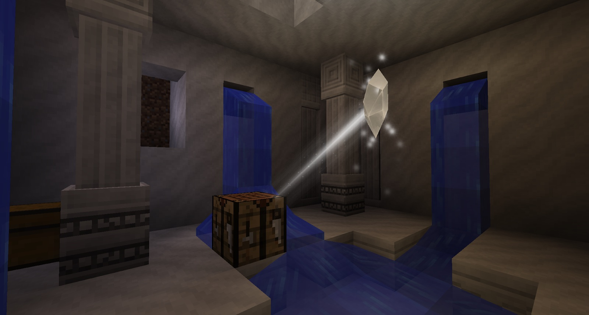

The first thing you will need to do in order to get started will be to gear up with food, some armor, a crafting table, a sword and a pickaxe. You will need to scour the world and find as many shrines as possible and as many Constellation Papers as you can. You will want to pick up some Marble and hope you get lucky in finding an Ender Pearl or two. You will also have to do a bit of digging around the bottom of rivers because you will need a bit of Aquamarine.    

You will want to read into your Tome and place any Constellation Papers (with Constellations on them) you find into it (sneak-right-click the Tome). The *Discovery* tab will give you more details about Crystals, ores and other things.

Once you have found a large shrine you will want to dig into it to find the Collector Crystal inside.

