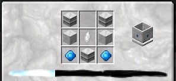

The Lightwell needs to be crafted in the Luminous Crafting Table and requires a few Rock Crystals. Now when you hover over Rock Crystals and hold sneak you can see some properties of the Rock Crystal such as _Size_, _Purity_ and _Cutting_. When crafting your Lightwell make sure you pick the crystal with the LOWEST Purity, because you will need the higher Purity crystals later. The Purity of the crystal used has no effect on the Lightwell (but does for some other crafted blocks).

Put the Lightwell down under an open sky, then right-click the Lightwell with a valid item in hand to create Liquid Starlight. These items can’t be removed from the Lightwell, and will continue to generate Liquid Starlight until they shatter.

Valid items starting with the (lowest to highest) starlight generation and (highest to lowest) shatter chance:

* Aquamarine
* Resonating Gems
* Rock Crystals
* Attuned Rock Crystals
* Celestial Crystals
* Attuned Celestial Crystals

It is best to start this process at the beginning of the night in order to get the most out of your items as you will get little to none during the day. Keep in mind that Lightwells can only hold up to 2 buckets of Liquid Starlight so you will want a liquid container nearby to put Liquid Starlight into during generation.

>>>> Using Aquamarine could be costly because they can break while generating Liquid Starlight, meaning you might go through a lot of them.

If you have a lot of Rock Crystals you can use the ones with the **lowest** purity. You will get more Liquid Starlight with a Rock Crystal than an Aquamarine. Be sure to have a bucket on hand to empty the Lightwell.

Liquid Starlight behaves similarly to water. It moves WaterMills, flows a lot faster than water, gives you night vision when you stand in it, and it will freeze when in contact with water. When using it with other Mods, please note that it is considered very cold. If you try to extract this liquid via Thermal Expansion Fluid Ducts they will break (you will need to use Reinforced Liquid ducts). Liquid Star Light can be pumped out from the bottom of the Lightwell.
