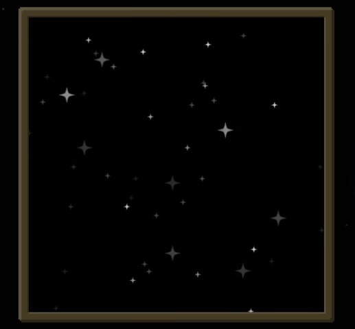

Next, you want to craft the Looking Glass. This will require a little bit of Starlight. As long as you craft this at night in an area with a high density of Starlight then this should be no problem.

With the Looking Glass in hand right-click and look into the sky, a box will pop up which is zoomed into the sky. What you are looking for is Constellations. You will know when you have found these when you see bigger stars that fade in and out in the center in the box. Some nights you will find Constellations and other nights you might not. Or you might see different ones each night. Also be aware if you are too close to things, such as buildings, the screen will go black.

Once you have found a Constellation, exit out of the telescope (don’t move) and open your Tome. You want to find out what Constellation this is, you will need to open the Constellation tab.

Once you have found it, open your telescope and HOLD sneak. A mouse pointer will appear. Click and drag to draw the consolation. Once you have done this you will discover the Constellation.

When you look at the sky without a Looking Glass you will be able to see the Constellation you discovered. Some nights it will be out others it will not (because the world rotates). The handheld telescope allows you to find the brightest Constellations out night.

It is important to know that the Constellation Horologium will appear every 36 days so it is very rare. Add to this that it will FIRST appear on any evening between days 15 and 51. If Horologium first appears on day 20 it will then appear on day 56 (Day 20 + 36 days = Day 56) and then every 36 days.

Now that you have found your first Constellation it’s best if you try to find new ones each night, but this is not always possible. You also have some new tools at your disposal. There are a total of 12 Constellations that can be found with the looking glass.
