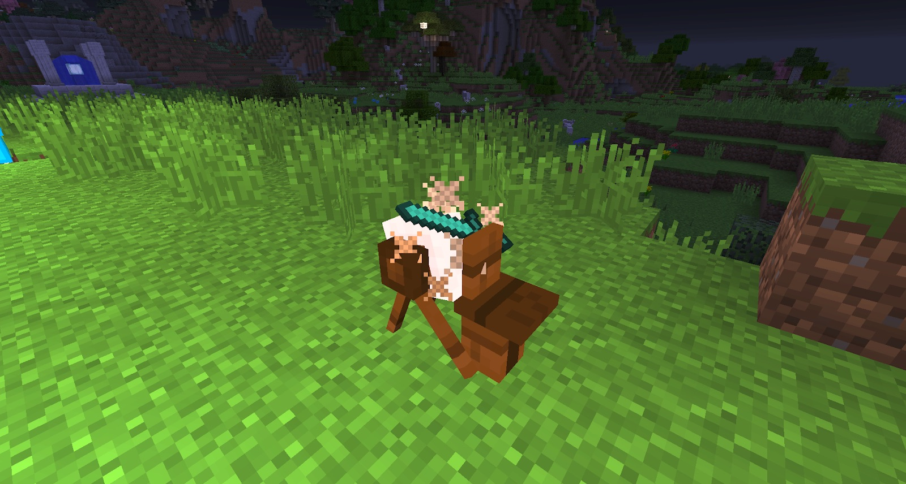

A Grindstone is very simple to make and does not require much Starlight. It will allow you to enhance your tools (Pickaxe and Axe) and weapons. Throwing a sword in and then right-clicking the grindstone will make sparks appear. Once these stop appearing you can take out your weapon (sneak-right-click) and you will notice your weapon is now sharpened, which grants a 10% damage increase.

This works even better with Rock Crystal tools. Once you have created your Rock Crystal sword you can throw it into Liquid Starlight to **increase** its size further. Be aware that when you submerge Rock Crystals or Rock Crystal tools in Liquid Starlight it may increase its size but it will **decrease** its CUTTING unless the Crystal was split before hand. Size will only decrease when used in the grindstone. When the size goes down to 0 it will destroy the item.

The **Purity** of the Crystals can be boosted by “Splitting.” This process requires Rock Crystals to be thrown into Liquid Starlight. When the Crystals reach max Size they have a chance to “Split” (basically double). This process can be repeated but it will reduce the Size of the Crystal by a lot and will randomise the Cutting.

These weapons can be stronger and faster than their diamond counterparts but they will dull overtime, losing attack damage.
