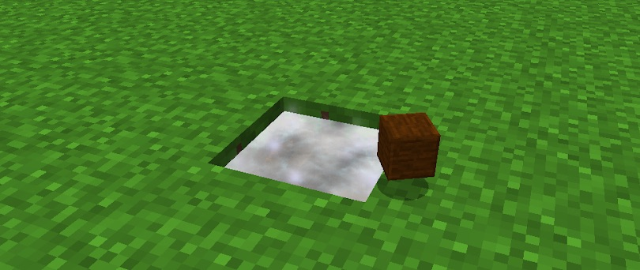
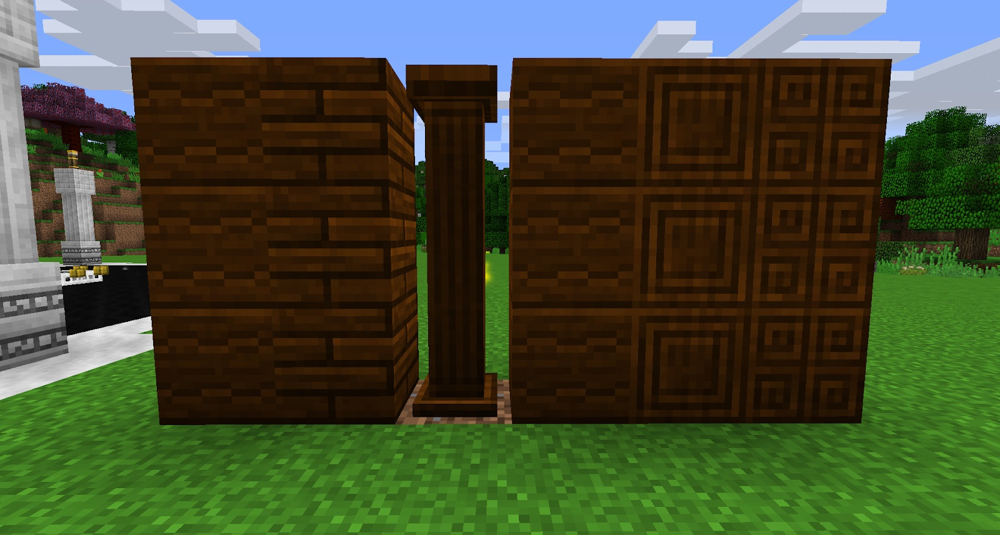

Infused Wood is a decorative and a crafting material. It can be crafted by dropping Oak Logs into a source block of Liquid Starlight (this will not use up the Liquid Starlight).

There are 7 Different types of Infused wood that can be crafted:

* Infused Wood
	* Drop Oak Logs into Liquid Starlight.
* Infused Wood Planks
	* Put Infused Wood into any normal crafting table.
* Infused Wood Columns
	* 3 Infused Wood Planks in an I Shape in a Luminous Crafting Table.
* Infused Wood Arch
	* 3 Infused Wood Planks in an --- Shape in a Luminous Crafting Table.
* Engraved Infused Wood
	* 4 Infused Wood Planks in a Diamond Shape in a Luminous Crafting Table.
* Enriched Infused Wood
	* 4 Infused Wood Planks in a Diamond Shape with a Aquamarine in the middle in a Luminous Crafting Table.
* Vibrant Infused Wood
	* Infused Wood in a Starlight Infuser.

