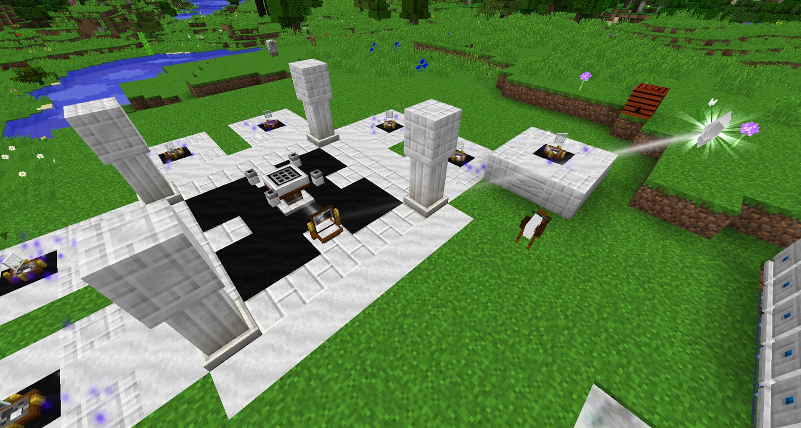

Next you want to craft the Linking Tool and a few Lenses, these items must be crafted in the new Starlight Crafting Altar. In order to gain even more Starlight you can link the Collector Crystals you found in one of the big Shrines to your Starlight Crafting Altar. Depending on how far away your Altar is, it might not be difficult to get it to reach.

Before crafting a bunch of lenses keep in mind the following:
* **Purity** - The higher the Purity the more Starlight can pass through the lens.
* **Size** - This will increase the quantity of lenses you make with each crafting.

Putting a Lens down between your Starlight Crafting Altar and the Collector Crystal will allow you to link the Crystal with the lens by simply right-clicking the Crystal then the Lens with the Linking Tool. Once it has been linked, a beam of light will come from the Collector Crystal to the lens. Next you can link the lens with the altar by right-clicking the lens, and then the altar. Sneak-right-clicking the block will unlink the block.

>>>> The above example is **NOT** perfect as the Spectral Relay's are far to close together

 

>>>>> When you use imperfect lenses, the further you go away from the Collector Crystal the weak and weaker the beam will be . The more impure the Lenses the more Starlight you will lose.

