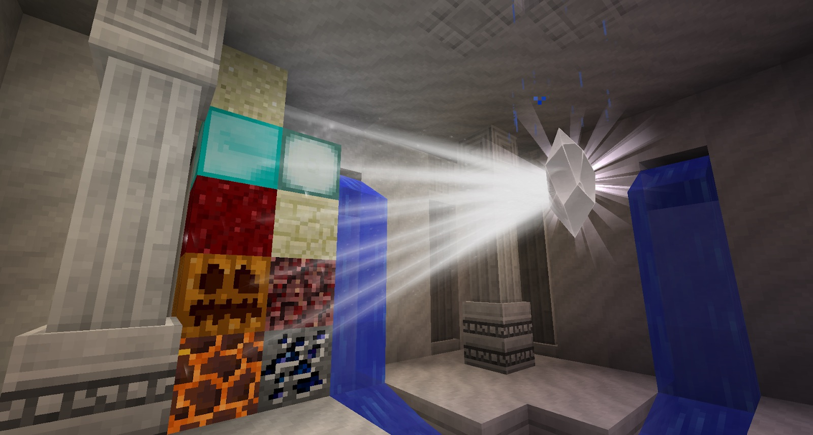

The Linking Tool is not just used to bind Collector Crystals to lenses, it can also be used in Iron Transmutation. Setting down some Iron ore near a Collector Crystal, you can use the Linking Tool to link the Collector Crystal to the ore. Over time this ore will change into Star Metal Ore. We can smelt this into a Starmetal Ingot and in turn this can be ground down (on the grinder) into 3 Stardust.

>>>>>> It should be noted that giving sky clearance to the collector crystal in the large shrine makes it work much faster!  

With this Stardust you can craft a “Scroll of Written Expertise” which you can give to other people. This enables them to share the research you have so far.

Here is a list of all the blocks you can transmute and their results:
* Iron - Starmetal Ore
* Netherrack - Nether Brick
* Sandstone - Endstone
* Sea Lantern - Lapis
* Magma Block - Obsidian
* Pumpkin - Cake
* Netherwart Block - Soul Sand
* Diamond Ore - Emerald Ore
* Sand - Clay

Now that you can transmute and have a healthy amount of Stardust, you can make some new toys!
