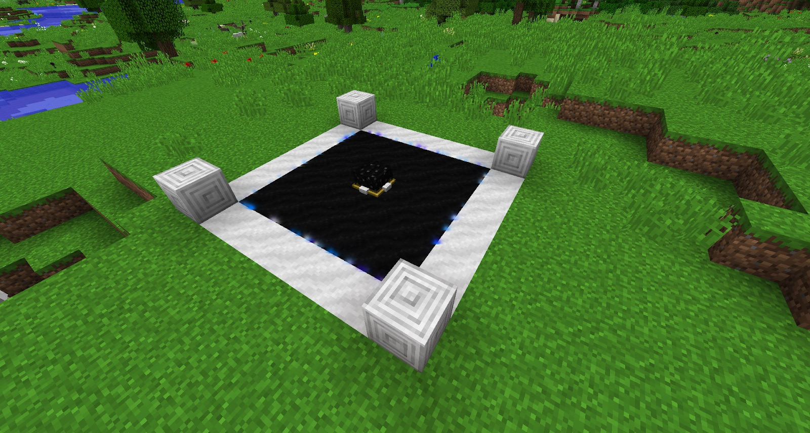
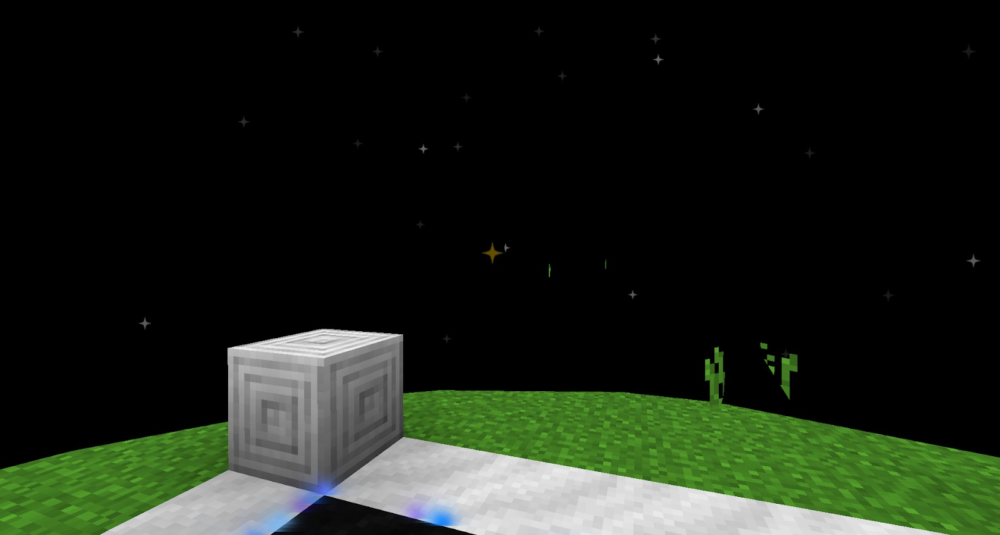

With the Stardust and the Stardust Ingots you can move on to the Celestial Gateway. This requires a Rock Crystal but there is no need to worry about its attributes. You also need to build a structure for the Celestial Gateway to sit on. The design, as well as the required materials, can be found in the Tome. This needs to have access to the sky or Bedrock (this will work interdimensionally, even with modded dimensions like Galacticraft).

Once the base is complete and the Celestial Gateway placed down, your Celestial Gateway should light up around the black blocks. Once you step inside this area a dark dome appears around you that stops at ground level. This is a teleportation pad. You can build more of these in your world (and other dimensions) and they will link to each other.

When you have built more than one, a gold star will appear in the dome indicating the other gateway(s). These stars will be above ground level you so you will always be able to find them. If there is anything in the way (such as a tree) you will may not be able to see the whole dome.

You can rename the gateway in an anvil which will create a small caption appearing on the star while looking at it, allowing you to differentiate between different locations.

If you stand in the middle of the dome and sneak-right-click on a gold star, you will be teleported to that location. These also work in the Nether, End and other dimensions added by mods.
