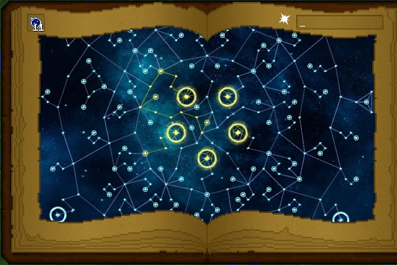

These are much like bonuses and work like a Talent Tree. You get one free “point” to spend at first and, as you level up, you can gain more. You must put points into all of the prerequisite perks before unlocking higher level perks.

You can level up to 30 times and anything beyond level 17 is a bit of a grind. You will need to attune yourself with 1 Constellation but this does not mean that you are locked into that constellation.

Because you have 30 levels does not mean you have 30 points as some perks offer additional points, in the center of the perk ring is “Singularity”. This enables you to pick more roots, this means you are technically attuned to more than one constellation, you could attune yourself to all 5:

Now this is not the most efficient way to spend perk points but it does let you dip into other constellation benefits.
