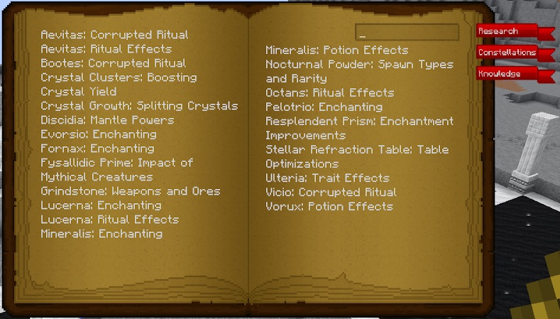

Shooting stars will appear randomly in the middle of the night, they still start from the moon and slowly travel in a downwards arch towards the ground, once they hit the ground they will explode much like TNT (this can be turned off in the configs).

To collect the loot these shooting stars drop you will need to follow the star on foot (flying would be easier), if you are not quick enough the star will land but there will be no loot. 

Among all of the loot you can also find a Shining Casing  (these are not in JEI):

These Casings contain a Lucent Scroll which can be right clicked, once right clicked you will either gain knowledge about a certain aspect of Astral Sorcery or a new constellation, these constellations can be found in the sky and drawn out, unlike normal constellations they will disappear but give you more knowledge about Astral Sorcery.

Think of this as extra lore or flavor text. This new knowledge can be found in your tomb under a new tab “Knowledge”:

This knowledge will stay with you as long as you have Astral Sorcery in your pack, so loading up a new world you will find these knowledge in your tomb. This knowledge does not give you any kind of real advantage, it’s just flavour text.