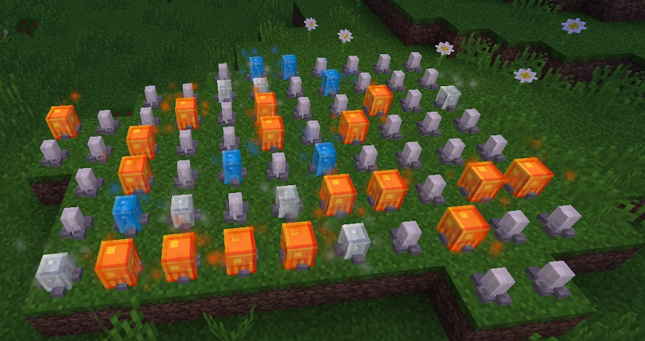

These gems are grown in the same matter that Crystals are grown except instead of using Stardust as the catalyst you will need to use Glowstone. These clusters will sparkle when they are ready for harvesting (with a pickaxe), harvesting these too early will net you nothing.

These crystals grow in the same manner as Celestial crystals but these gems are used in the perk tree:

The stats on these gems is random and there are 3 different kinds:

* Ilium Gems
* Fengarum Gem
* Ourium Gem

Growing these crystals takes time and is very reliant on luck, because you have a chance of getting any of the 3 crystals from growing them, you are never guaranteed to get a Illium or a Ourium gem, these gems are no different from each other, the stats are always random.

It would be advisable to plant these gems as quickly and as early as possible because growing them takes time and is mostly about luck.