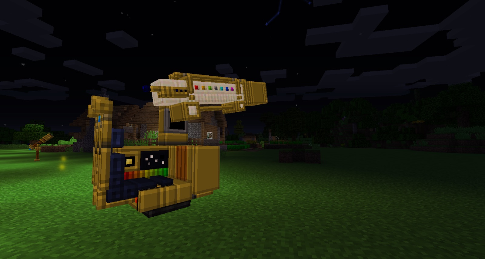

The Observatory enables you to find four new Constellations. These are Faint Constellations and can only be found with the Observatory because they are further away. When placed down, you will be able to get into the Observatory by right-clicking the seat. Once inside you will be able to see the night sky. Moving your mouse around will scan the night sky. Searching and drawing out the constellations works just like the looking glass:

The new constellations are **purple** and can be seen in the night sky once found:

You can also use the Observatory to find any other Constellations that you have not found.
