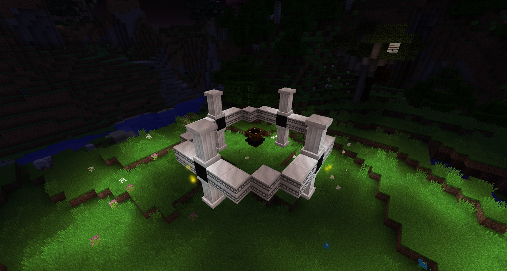

The Evershifting Fountain is made up of four parts. The idea behind it is that the Fountain will extract liquids from below bedrock. These liquids are not infinite so you have to move the Fountain to drain other liquids from other places around the world.

The main liquids are water and lava, and in order to find out where these liquids are you will need an Ichosic Resonator. When walking (or flying) around with this in your hand you will notice little Red and Blue fountains coming out of the ground:

This will tell you where there are water or lava deposits. You will need to build your Ever Shifting Fountain above one of these points.

>>>>> When you sneak-click the Ichosic Resonator it will act like a Fosic Resonator.

Check your Astral Tome for details on how to build the Fountain. Once built, you will need to add more parts to it in order for it to work fully.

To finish off the Fountain you will need a Chalice on top of it and a Neromantic Prime on the bottom of the Fountain.

Once in place the only thing left to do is add Liquid Starlight to the Chalice. This will start the Fountain. Before fully starting the Fountain you want to add a few Chalices around the Fountain to collect the water or lava below Bedrock. When the Fountain starts, it will dig below it to bedrock and mine up any blocks in the way. These blocks will be dropped around the Fountain. The Fountain will continue to fill up surrounding Chalices with either water or lava until the Starlight has run out of the Chalice on top of the Fountain. Once the Lava or Water “pool” has been exhausted the fountain will stop and you will need to move the entire structure in order to start the whole process again.

Remember that if you put any blocks on the inside of the structure it will stop, on top is fine but not inside.

